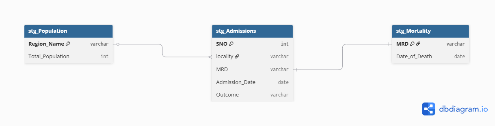
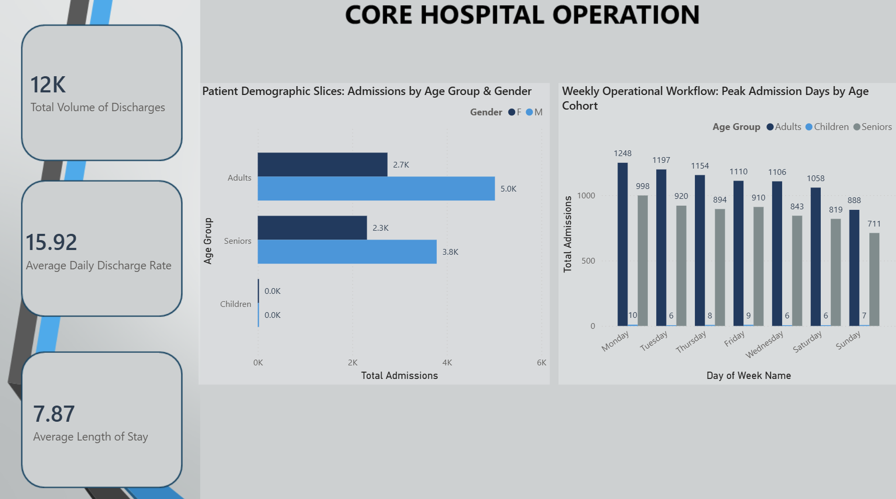
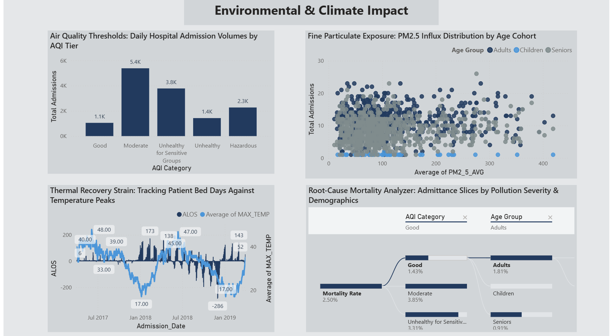

AutoCare Hospital Admissions: End-to-End Relational Analytics Pipeline
📖 Project Introduction
Modern healthcare analytics recognizes that public health outcomes do not exist in a vacuum; environmental factors profoundly shape patient volumes and hospital constraints. However, air quality logs, weather metrics, and clinical admission records are rarely consolidated, leaving leadership blind to how environmental shocks influence daily operations.
This portfolio project simulates a real-world scenario where a Data Analyst at AutoCare Hospital is tasked with answering critical executive questions regarding patient throughput, clinical outcomes, and their specific relationships to daily atmospheric pollution levels.
Instead of building isolated, static reports from raw spreadsheets, this project engineers a robust, end-to-end data pipeline. The workflow ingests three distinct raw data categories (Hospital Admissions, Air Quality/Pollution index logs, and Patient Mortality records), transforms them into a highly optimized relational database schema within SQL Server using strict referential integrity, and surfaces actionable insights through an interactive, executive-facing Power BI dashboard.

Key Business Questions Addressed:
1. Operational Benchmarks: What is the total volume of patient discharges, average daily discharge rate, and average Length of Stay (ALOS) across the facility?
2. Demographic Footprint: How are patient admissions and discharges distributed across distinct age demographics and gender classifications?
3. Weekly Fluctuations: Which days of the week experience peak patient discharge traffic and admission surges?
4. Air Quality Correlatives: Do spikes in the Air Quality Index (AQI) or specific particulates (like PM2.5) directly correlate with immediate surges in daily hospital admission volumes?
5. Weather & Strain: How do extreme changes in daily environmental variables—such as maximum temperature peaks or humidity fluctuations—impact a patient's average Length of Stay (ALOS)?
Severe Pollution Outcomes: Is there a measurable relationship between periods of severe air pollution index (AQI) scores and critical clinical metrics like post-admission mortality outcomes?

Phase 1: Data Extraction & Database Ingestion (EL)
1. Data Sourcing
The raw data is extracted from the Kaggle dataset repository and consists of three separate entity tracking tables in flat CSV format:
• HDHI Admission data.csv (Core patient transactional log)
• Pollution data.csv (Regional baseline demographics)
• Mortality data.csv (Patient mortality logs)
2. Ingestion Mechanism
Using the SQL Server Import and Export Wizard, the raw CSV files were mapped and loaded directly into a local SQL Server instance database named auto care DB.
During this initial "Extract & Load" phase, the data was intentionally staged into generic tables with no structural rules, constraints, or indexing applied:
• stg_Admissions
• stg_Pollution
• stg_Mortality

 Phase 2: Relational Database Schema & Architecture

Entity-Relationship Diagram (ERD) Text Breakdown
To transition this project from a collection of flat files into an enterprise-grade relational structure, the datasets were organized into a Star-like Schema Configuration. This layout establishes a central transactional fact table surrounded by descriptive environmental and clinical dimension tables to maximize performance and guarantee data integrity.
1. Central Fact Table: stg_Admissions
This table acts as the transactional core of the entire database, logging every individual patient admission event at AutoCare Hospital.
• Primary Key (PK): SNO (Serial Number). This column holds a completely unique integer for every row, representing a specific admission record. Note: The Medical Record Number (MRD) cannot be the primary key here because a single patient can be admitted to the hospital multiple times over their lifespan.
• Foreign Key 1 (FK): Admission_Date. This column records the calendar date of the patient's entry. It maps directly back to the DATE primary key column in the stg_Pollution table, creating a Many-to-One (N:1) relationship (multiple patients can be admitted on the exact same date under the same environmental conditions).
• Key Field: MRD (Medical Record Number). This unique patient identifier tracks clinical histories across individual rows and connects directly to the mortality logs.
2. Environmental Dimension Table: stg_Pollution
This table acts as a chronological timeline lookup containing master records of localized daily atmospheric pollution metrics and weather status updates.
• Primary Key (PK): DATE. This column stores completely unique calendar dates with zero duplicates, serving as the master anchor for cross-examining admission volumes against daily Air Quality Index (AQI) ratings, PM2.5 averages, temperature peaks, and humidity levels.
3.Clinical Dimension Table: stg_MortalityThis specialized table tracks confirmed patient death outcomes linked directly to specific hospital stays.Primary Key / Foreign Key (PK, FK): SNO (Serial Number). Because a specific hospital admission event can logically only result in a final mortality outcome once, the SNO column serves as a completely unique identifier in this table. It maps directly back to the matching SNO field in the central stg_Admissions fact table, establishing a clean One-to-One (1:1) relationship extension. This allows analysts to pin down the exact environmental and operational factors present during that specific terminal admission.

Phase 3: Initial Cleaning & Enforcing Referential Integrity
Before SQL Server allows you to establish relational links (Primary and Foreign Keys), the tables must be aggressively cleaned. If duplicate keys, orphaned records, or null values exist in key columns, the database engine will throw an execution error.
1. Cleaning and Setting Up the Pollution Table
• Step A (ALTER COLUMN ... NOT NULL): We tell the database that the DATE column can never be left empty. Every single row must have a valid date.
• Step B (ADD CONSTRAINT ... PRIMARY KEY): We turn the DATE column into the master key for this table. This guarantees that no two days can look exactly the same in our weather and air logs.
2. Cleaning and Setting Up the Admissions Table
• Step A (ALTER COLUMN ... NOT NULL): We make sure that the SNO (Serial Number) column can never have empty rows.
• Step B (ADD CONSTRAINT ... PRIMARY KEY): We turn SNO into the master key for this table. This ensures every single hospital visit has its own unique receipt or tracking number.
3. Deep Cleaning and Setting Up the Mortality Table
The Mortality file had some hidden duplicates and empty spaces from the download, so we cleaned it up using a 4-step checklist:
• Step A (Delete Blanks): We run a quick cleanup query to find and delete any completely empty rows at the bottom of the table.
• Step B (Remove Duplicates): Since a person can logically only die once, we cannot have the same patient ID (MRD) showing up multiple times. We use a smart counting trick called a CTE to scan the list, find repeated patient IDs, and delete the extra copies so only one clean record remains.
• Step C (Lock Column): Now that the column is perfectly clean, we lock it down so it can never accept empty entries in the future.
• Step D (Set Master Key): Finally, we set MRD as the official Primary Key for this table.

📊 Phase 4: Building the Staging Reporting Layer (SQL View)
Once the data constraints were fully locked into the base database tables, a specialized virtual staging layer (v_HospitalAdmission) was created to prepare the data for Power BI import.
Simple Step-by-Step Breakdown of the View Code:
1. Targeting the Environment (USE AutoCareDB): Tells SQL Server to execute the query within your specific database instance.
2. Dynamic Creation (CREATE OR ALTER VIEW): Builds the view container safely. If the view already exists, it updates it dynamically without breaking existing connections. 
3. The Logical Calculation Layer (WITH CleanData AS): Instead of permanently deleting historical logs from the physical database, a Common Table Expression (CTE) acts as a safe, temporary workbench.
Isolating Business Duplicates (ROW_NUMBER() OVER...): The script scans the table and groups rows by the Patient ID (MRD_No), Admission Date (D_O_A), and Discharge Date (D_O_D). If a patient has multiple rows with identical timestamps, it assigns them a sequential index number

📥 Phase 5:Data Ingestion: Connecting SQL Server to Power BI
To streamline our data architecture, we bypassed managing complex relationships (Star Schema transformations) inside Power BI. Instead, we consolidated our staging architecture into a single, flattened database view (v_HospitalAdmission) directly inside SQL Server. This provides a highly performant, single-table reporting layer for frontend analytics.
Now that our data model is completely flat inside Power BI, all environmental, demographic, operational, and mortality variables are available as attributes on a single row. This enables high-performance calculations without the need for complex relationship cross-filtering.

📊 Track 1: Core Hospital Operations
This analytical track focuses entirely on hospital capacity planning, asset utilization, and medical resource optimization. By transforming our flattened database view into operational key performance indicators (KPIs) and demographic segmentations, hospital administrators can gain immediate insight into facility throughput and staff workloads.
Key Metrics & Implementation Breakdown:
1. Total Volume of Discharges
• Objective: Isolates the exact number of patients who successfully completed their clinical treatment and left the facility.
• Logic: Calculated using a DAX CALCULATE function that counts total rows where the Outcome status matches the explicit string "Discharge". This removes incomplete stays or cases where patients left against medical advice.
2. Average Daily Discharge Rate
• Objective: Measures the day-to-day patient turnover speed to evaluate administrative and logistical velocity.
• Logic: Implemented via an AVERAGEX iterator. The metric aggregates total discharges against a unique list of active chronological calendar dates, generating a precise baseline for normal daily patient outflows.
3. Average Length of Stay (ALOS)
• Objective: Monitors the average number of days a hospital bed is occupied per patient visit, a vital baseline metric for capacity management.
• Logic: Built by first utilizing a DATEDIFF calculation between a patient's Admission_Date and Discharge_Date to establish individual lengths of stay (LOS_Days). A standard DAX AVERAGE function is then run against this column.
4. Patient Demographic Footprint
• Objective: Segments patient volume to reveal resource consumption patterns and clinical resource mapping.
• Logic: Created a logical SWITCH(TRUE()) conditional column to slice numerical patient ages into structured clinical cohorts: Children (<18), Adults (18–64), and Seniors (>=65).
5. Weekly Peak Traffic waves
• Objective: Identifies consistent operational spikes across specific days of the week to intelligently guide nurse scheduling and shift staffing allocations.
• Logic: Generated using the chronological FORMAT function to pull weekday string names, paired with an underlying chronological sort key (WEEKDAY) running Monday through Sunday. Slicing this chart dynamically by our engineered Age Group dimension uncovers exactly which demographic groups drive clinical bottlenecks on high-traffic days.

🌿 Track 2: Environmental & Climate Impact Analytics
This track focuses on environmental epidemiology, investigating how ambient atmospheric changes affect public health outcomes. By correlating clinical data with granular air quality index (AQI) tiers, fine particulate matter, and regional temperature variations, we can uncover external triggers for hospital admissions.

Key Metrics & Implementation Breakdown:

6. Air Quality Index (AQI) Impact Analysis
• Objective: Analyzes total admission volume across standardized air quality health brackets.
Logic: Applied a conditional logic mapping column to segment numeric AQI inputs into operational hazard levels (Good, Moderate, Unhealthy for Sensitive Groups, Unhealthy, Hazardous). A custom math-based sorting index (AQI Sort Order) was mapped to the raw numerical values to bypass frontend circular dependency errors and enforce logical risk progression on charts.

7. Particulate Matter Vulnerabilities
• Objective: Evaluates fine particulate matter concentrations against specific demographic cross-sections to pinpoint population vulnerabilities.
Logic: Constructed an advanced multi-variable Scatter Chart plotting granular, non-summarized daily admission dates. Mapping average daily PM micrometers against total admission counts—sliced by our engineered Age Group legend—reveals critical distribution clusters and exposure thresholds for vulnerable age groups.

8. Weather Extreme Length of Stay Strain
• Objective: Assesses if extreme changes in regional daily weather metrics alter patient recovery speeds and lengthen bed occupancy.
Logic: Deployed a dual-axis Line and Stacked Column Chart plotting daily hospital timelines. By superimposing average maximum temperature peaks (MAX_TEMP) over chronological operational metrics (ALOS), the visual exposes direct parallelisms between severe seasonal heatwaves and prolonged clinical recovery stays.

9. Severe Pollution Mortality Correlatives(Root-Cause Tree Analyzer)
• Objective: Examines whether hospital admission events taking place during peak air pollution windows display an increased risk profile for mortality.
Logic: Formulated a percentage-based Mortality Rate measure using a DIVIDE and CALCULATE algorithm tracking outcomes matching the explicit string status "Deceased". Instead of a standard line graph, this metric is deployed inside an interactive AI Decomposition Tree visual. This allows stakeholders to dynamically drill down and slice open patient admissions by AQI Category, Age Group, and Gender on the fly, instantly surfacing deep root-cause trends.

Conclusion:

This project successfully connects a SQL Server database to Power BI to turn raw hospital data into clean, interactive dashboards. By doing the heavy data cleaning in SQL and building the reporting logic in Power BI, the project delivers valuable insights across both analytical tracks:

Hospital Operations: With an Average Length of Stay (ALOS) of 7.87 days and clear visuals showing weekly traffic peaks, hospital managers can better plan bed capacity and optimize nurse staffing schedules based on busy days.

Environmental Impact: The dashboard clearly proves that poor air quality and weather extremes affect patient health. Using the interactive Decomposition Tree, users can see that while the overall hospital mortality rate is 2.50%, it drops or spikes significantly depending on the air quality (AQI) tier, age group, and gender of the patient.

Overall, this project showcases a complete data pipeline that helps hospital administrators make faster, data-driven decisions to improve both patient care and hospital efficiency.

🏥 Hospital Admissions & Environmental Impact Analytics Dashboard

View the interactive report here in following weblink:
https://app.powerbi.com/view?r=eyJrIjoiZjRkMzhkYWYtNWNiZC00NzE0LThlNmUtNDEyNDU4NTliZWVlIiwidCI6ImM2ZTU0OWIzLTVmNDUtNDAzMi1hYWU5LWQ0MjQ0ZGM1YjJjNCJ9

